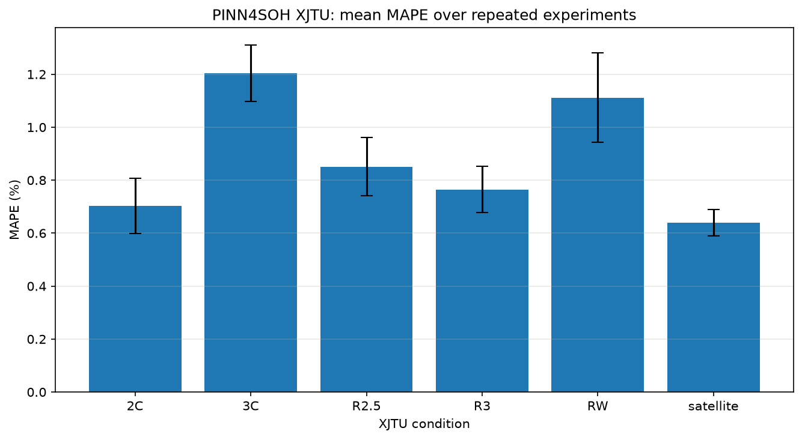

# PINN4SOH XJTU 完整 60 次实验报告（当前正式版本）

> 本报告对应当前数据流：16 项统计特征与 `cycle index` 一起进行逐电池 Min-Max 归一化，仅 `capacity`（SOH）不参与特征归一化。未归一化 `cycle index` 的旧结果仅作为历史基线，详见[受控对比报告](cycle_index归一化对训练结果的影响解读报告.md)。

## 实验协议

- 工况：`2C`、`3C`、`R2.5`、`R3`、`RW`、`satellite`；
- 每种工况：10 次独立训练，共 60 次；
- 随机种子：未固定，与上游随机重复协议一致；
- 最大训练轮数：200 epoch；
- Early Stop：验证 MSE 连续 21 轮未改善后停止（源码条件为 `counter > 20`）；
- Warmup：30 epoch；
- Batch size：256；
- 学习率：warmup `0.002`、base `0.01`、final `0.0002`；
- 动力学网络学习率：`0.001`；
- 损失权重：`alpha=0.7`、`beta=0.2`；
- 数据划分：文件名包含 4 或 8 的电池用于测试，其余电池用于训练和验证。

完整实验可从仓库根目录重新运行：

```powershell
python scripts/check_setup.py --full
python experiments/run_paper_60.py
```

若希望获得可重复的随机序列，可使用 `--seed 42`。这会形成确定性复跑协议，但不再等同于本报告使用的未固定种子协议。

## 汇总结果

| 工况 | MAPE 均值 | MAPE 样本标准差 | RMSE 均值 |
|---|---:|---:|---:|
| 2C | 0.7029% | 0.1036% | 0.009068 |
| 3C | 1.2039% | 0.1067% | 0.013077 |
| R2.5 | 0.8510% | 0.1096% | 0.010232 |
| R3 | 0.7652% | 0.0883% | 0.011196 |
| RW | 1.1117% | 0.1686% | 0.013194 |
| satellite | 0.6402% | 0.0498% | 0.010856 |



机器可读汇总保存在 [`docs/results/cycle_normalized_summary.json`](results/cycle_normalized_summary.json)。为控制仓库体积，60 个模型权重、逐次预测数组和全部单次图片不纳入 Git；运行脚本可以重新生成这些产物。

## 结果解读

- satellite 的平均 MAPE 最低，2C 次之；
- RW 的平均 MAPE 和随机波动在六种工况中最大，建议结合逐电池曲线检查；
- 六种工况的平均 MAPE 均处于约 `0.64%–1.20%`；
- 这些统计描述的是当前复现协议下的结果，不应直接等同于真实在线部署性能。

由于 60 次训练未固定随机种子，重新运行时不应期待逐位复现表中小数。合理的复核目标是：数据数量、训练协议和指标量级一致，并在足够重复次数下获得相近的均值与波动范围。

## 已知方法学限制

1. `cycle index` 按每节完整电池独立归一化，可能间接使用该电池的完整寿命长度；
2. 特征提取原始实现未公开，本报告使用上游提供的预提取 CSV；
3. 论文单调性损失公式与公开源码存在差异，本复现以公开源码行为为准；
4. 神经网络训练随机性、软件版本和硬件差异均可能影响最终指标；
5. 本报告验证的是论文复现协议，不构成真实储能系统或在线 BMS 部署效果证明。

## 与旧版结果的关系

旧版代码错误地让 `cycle index` 保持原始循环编号，导致它与其余 `[-1,1]` 输入存在明显尺度失衡。旧版机器可读汇总保存在 [`docs/results/cycle_unscaled_summary.json`](results/cycle_unscaled_summary.json)，仅用于受控对照，不再作为正式复现结果。
